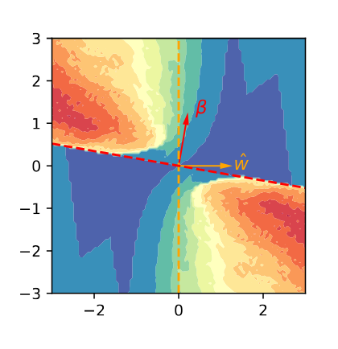

# HD_influences
Companion repository for the paper:  _Influence Diagnostics in High-dimensional M-estimation: Precise Asymptotics_

This repository provides a self-contained code for the influence diagnostic experiment on MNIST, Fig. 5. (left).

<b> Versions:</b> These notebooks employ <tt>Python 3.12 </tt>, and <tt>Pytorch 2.5</tt>.
